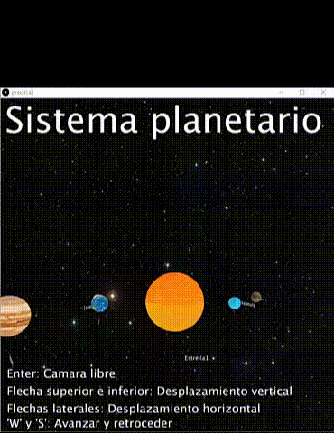

# Sistema planetario con cámara libre
Practica 4 de CIU
# CIU - Práctica 4
# Rubén García Quintana

## Visualización de sistema planetario desde una camara libre.

Esta práctica consiste en crear una opción de cámara libre para el sistema planetario desarrolado en la anterior práctica.

Aqui podemos ver un gif con una pequeña demostración de su ejecución. 

### Desarrollo de la práctica

Para la realizacion de esta practica, se ha usado como base la práctica 3 desarrollada anteriormente y se le ha añadido una opción para pode navegar por el sistema planetario.

Para el desarrollo de la práctica se ha añadido una variable que funcione como selector de modo libre o el modo de observación normal.

Para el desarrollo de la camara se ha utilizado el metodo "camera()" que nos permite posicionar la vision de nuestro modelo 3D.

